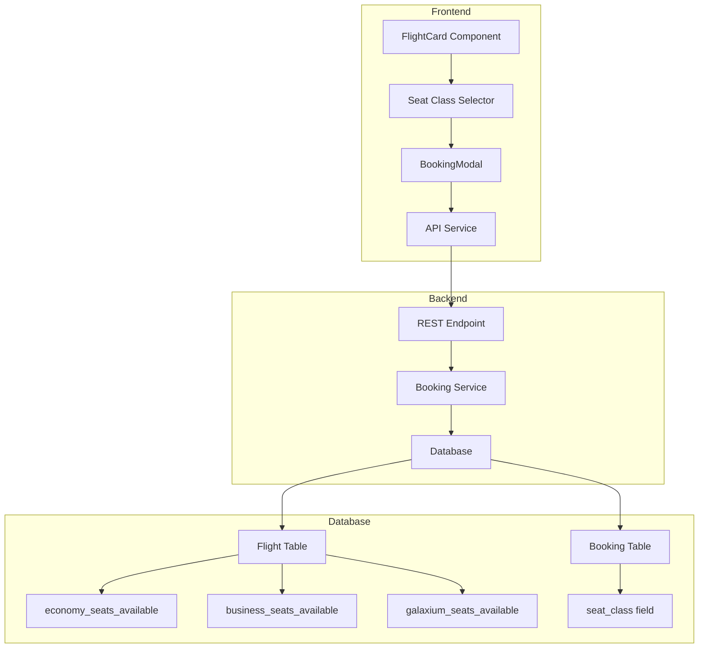

# Implementation Guide: Seat Classes Feature

## Executive Summary

This document provides a comprehensive guide for implementing three seat classes (Economy, Business, Galaxium) in the Galaxium Travels booking system.

**Key Specifications**:
- **Seat Classes**: Economy (💺), Business (🛋️), Galaxium (👑)
- **Pricing**: Economy = base price, Business = 2x, Galaxium = 5x
- **Allocation**: 60% Economy, 30% Business, 10% Galaxium
- **Example**: 10 total seats = 6 Economy, 3 Business, 1 Galaxium

---

## Architecture Overview



---

## Implementation Phases

### Phase 1: Backend Foundation (Day 1-2)

#### Step 1.1: Database Schema Migration
**Priority**: CRITICAL - Must be done first

1. **Backup existing data** (if in production)
2. **Update models.py**:
   - Modify `Flight` model: add seat class columns
   - Modify `Booking` model: add `seat_class` field
3. **Drop and recreate database** (development):
   ```bash
   cd booking_system_backend
   python seed.py
   ```

**Files to modify**:
- [`booking_system_backend/models.py`](../booking_system_backend/models.py)

**Verification**:
```bash
# Check database schema
sqlite3 booking_system.db ".schema flights"
sqlite3 booking_system.db ".schema bookings"
```

#### Step 1.2: Update Schemas
**Priority**: HIGH - Required for API contracts

1. Update `FlightOut` schema with new fields
2. Update `BookingRequest` to include `seat_class`
3. Update `BookingOut` to include `seat_class`

**Files to modify**:
- [`booking_system_backend/schemas.py`](../booking_system_backend/schemas.py)

#### Step 1.3: Update Services
**Priority**: HIGH - Core business logic

1. **Flight Service**:
   - Modify `list_flights()` to calculate prices for each class
   - Return all seat availability fields

2. **Booking Service**:
   - Update `book_flight()` to accept `seat_class` parameter
   - Add seat class validation
   - Decrement correct seat class counter
   - Update `cancel_booking()` to restore correct seat class

**Files to modify**:
- [`booking_system_backend/services/flight.py`](../booking_system_backend/services/flight.py)
- [`booking_system_backend/services/booking.py`](../booking_system_backend/services/booking.py)

#### Step 1.4: Update API Endpoints
**Priority**: HIGH - External interface

1. Update REST endpoints in `server.py`
2. Update MCP tools to accept `seat_class`
3. Update error handling for invalid seat classes

**Files to modify**:
- [`booking_system_backend/server.py`](../booking_system_backend/server.py)

#### Step 1.5: Update Seed Data
**Priority**: MEDIUM - For testing

1. Add seat distribution calculation function
2. Update flight creation with seat class fields
3. Update booking creation with random seat classes

**Files to modify**:
- [`booking_system_backend/seed.py`](../booking_system_backend/seed.py)

**Testing Phase 1**:
```bash
# Run backend tests
cd booking_system_backend
pytest tests/ -v

# Manual API testing
curl http://localhost:8080/flights
curl -X POST http://localhost:8080/bookings \
  -H "Content-Type: application/json" \
  -d '{"user_id":1,"name":"Alice","flight_id":1,"seat_class":"economy"}'
```

---

### Phase 2: Frontend Implementation (Day 3-4)

#### Step 2.1: Update Type Definitions
**Priority**: CRITICAL - Foundation for TypeScript

1. Update `Flight` interface with new fields
2. Update `Booking` interface with `seat_class`
3. Update `BookingRequest` interface
4. Add `SeatClass` type and helper types

**Files to modify**:
- [`booking_system_frontend/src/types/index.ts`](../booking_system_frontend/src/types/index.ts)

**Verification**:
```bash
cd booking_system_frontend
npm run build  # Should compile without errors
```

#### Step 2.2: Update FlightCard Component
**Priority**: HIGH - Primary user interaction

1. Add seat class selection UI
2. Display pricing for all three classes
3. Show availability per class
4. Add visual differentiation (icons, colors)
5. Update booking callback to include seat class

**Files to modify**:
- [`booking_system_frontend/src/components/flights/FlightCard.tsx`](../booking_system_frontend/src/components/flights/FlightCard.tsx)

**Design Specifications**:
- Economy: Blue theme (💺)
- Business: Purple theme (🛋️)
- Galaxium: Gold theme (👑)

#### Step 2.3: Update BookingModal Component
**Priority**: HIGH - Confirmation flow

1. Accept `seatClass` prop
2. Display selected class prominently
3. Show class-specific pricing
4. Update confirmation callback

**Files to modify**:
- [`booking_system_frontend/src/components/bookings/BookingModal.tsx`](../booking_system_frontend/src/components/bookings/BookingModal.tsx)

#### Step 2.4: Update BookingCard Component
**Priority**: MEDIUM - Display existing bookings

1. Add seat class badge display
2. Show class-specific styling
3. Display class icon

**Files to modify**:
- [`booking_system_frontend/src/components/bookings/BookingCard.tsx`](../booking_system_frontend/src/components/bookings/BookingCard.tsx)

#### Step 2.5: Update Pages
**Priority**: HIGH - Integration

1. **Flights Page**:
   - Update state management for seat class
   - Pass seat class to booking modal
   - Update API call with seat class

2. **MyBookings Page**:
   - Display seat class in booking cards
   - Optional: Add class filter

**Files to modify**:
- [`booking_system_frontend/src/pages/Flights.tsx`](../booking_system_frontend/src/pages/Flights.tsx)
- [`booking_system_frontend/src/pages/MyBookings.tsx`](../booking_system_frontend/src/pages/MyBookings.tsx)

**Testing Phase 2**:
```bash
# Start frontend dev server
cd booking_system_frontend
npm run dev

# Manual testing checklist:
# - View flights with all three classes
# - Select each class and verify pricing
# - Book a flight in each class
# - Verify booking appears in My Bookings with correct class
# - Cancel booking and verify seat restoration
```

---

### Phase 3: Testing & Refinement (Day 5)

#### Step 3.1: Backend Testing
**Priority**: HIGH

1. Update existing tests for new schema
2. Add tests for seat class validation
3. Add tests for seat availability per class
4. Add tests for cancellation restoration

**Files to modify**:
- [`booking_system_backend/tests/test_services.py`](../booking_system_backend/tests/test_services.py)
- [`booking_system_backend/tests/test_rest.py`](../booking_system_backend/tests/test_rest.py)

**Test Cases**:
```python
# Key test scenarios
- Book economy seat successfully
- Book business seat successfully
- Book galaxium seat successfully
- Reject invalid seat class
- Reject booking when class is sold out
- Verify correct seat count decrements
- Verify cancellation restores correct class
- Verify price calculation for each class
```

#### Step 3.2: Frontend Testing
**Priority**: MEDIUM

1. Visual regression testing
2. Responsive design testing (mobile, tablet, desktop)
3. Accessibility testing
4. Error handling testing

**Manual Test Checklist**:
- [ ] All seat classes display with correct icons
- [ ] Prices calculate correctly (1x, 2x, 5x)
- [ ] Cannot select sold-out classes
- [ ] Selection state is clear and visible
- [ ] Booking modal shows correct class and price
- [ ] My Bookings displays class badges
- [ ] Mobile layout is usable
- [ ] Keyboard navigation works
- [ ] Screen reader announces changes

#### Step 3.3: Integration Testing
**Priority**: HIGH

1. End-to-end booking flow for each class
2. Concurrent booking scenarios
3. Edge cases (last seat, sold out, etc.)

**Test Scenarios**:
```
Scenario 1: Book last economy seat
- Verify economy becomes unavailable
- Verify other classes still available

Scenario 2: Book all seats of one class
- Verify class shows as sold out
- Verify total availability updates

Scenario 3: Cancel and rebook
- Cancel economy booking
- Verify economy seat restored
- Book business seat
- Verify business seat decremented
```

---

## Data Migration Strategy

### For Development/Demo Environment

**Approach**: Drop and recreate database

```bash
cd booking_system_backend
python seed.py
```

**Pros**:
- Simple and fast
- Clean slate
- No migration complexity

**Cons**:
- Loses all existing data
- Not suitable for production

### For Production Environment (Future)

**Approach**: SQL migration script

```sql
-- Step 1: Add new columns to flights table
ALTER TABLE flights ADD COLUMN base_price INTEGER;
ALTER TABLE flights ADD COLUMN total_seats INTEGER;
ALTER TABLE flights ADD COLUMN economy_seats_available INTEGER;
ALTER TABLE flights ADD COLUMN business_seats_available INTEGER;
ALTER TABLE flights ADD COLUMN galaxium_seats_available INTEGER;

-- Step 2: Migrate existing data
UPDATE flights SET 
  base_price = price,
  total_seats = seats_available,
  economy_seats_available = CAST(seats_available * 0.6 AS INTEGER),
  business_seats_available = CAST(seats_available * 0.3 AS INTEGER),
  galaxium_seats_available = seats_available - 
    CAST(seats_available * 0.6 AS INTEGER) - 
    CAST(seats_available * 0.3 AS INTEGER);

-- Step 3: Add seat_class to bookings (default to economy)
ALTER TABLE bookings ADD COLUMN seat_class TEXT DEFAULT 'economy';

-- Step 4: Drop old columns (optional, after verification)
-- ALTER TABLE flights DROP COLUMN price;
-- ALTER TABLE flights DROP COLUMN seats_available;
```

**Pros**:
- Preserves existing data
- Gradual migration possible
- Rollback capability

**Cons**:
- More complex
- Requires careful testing
- May need downtime

---

## Pricing Strategy Documentation

### Base Pricing Model

**Economy Class** (Base Price):
- Standard interplanetary travel
- Basic amenities
- Most affordable option
- Price = `base_price`

**Business Class** (2x Premium):
- Enhanced comfort
- Priority boarding
- Extra legroom
- Price = `base_price × 2`

**Galaxium Class** (5x Luxury):
- Ultimate luxury experience
- Private cabin
- Gourmet meals
- Concierge service
- Price = `base_price × 5`

### Example Pricing

| Route | Economy | Business | Galaxium |
|-------|---------|----------|----------|
| Earth → Mars | $1,000,000 | $2,000,000 | $5,000,000 |
| Earth → Moon | $500,000 | $1,000,000 | $2,500,000 |
| Earth → Pluto | $5,000,000 | $10,000,000 | $25,000,000 |

### Dynamic Pricing Considerations (Future Enhancement)

Potential future features:
- Demand-based pricing
- Early bird discounts
- Last-minute deals
- Seasonal variations
- Loyalty program multipliers

---

## Rollout Plan

### Pre-Launch Checklist

**Backend**:
- [ ] Database schema updated
- [ ] All services updated
- [ ] API endpoints tested
- [ ] MCP tools updated
- [ ] Seed data generates correctly
- [ ] All tests passing

**Frontend**:
- [ ] Type definitions updated
- [ ] All components updated
- [ ] Pages integrated
- [ ] Styling complete
- [ ] Responsive design verified
- [ ] Accessibility checked

**Integration**:
- [ ] End-to-end flow tested
- [ ] Error handling verified
- [ ] Edge cases covered
- [ ] Performance acceptable

### Launch Steps

1. **Backup current database** (if production)
2. **Deploy backend changes**:
   ```bash
   cd booking_system_backend
   python seed.py  # Recreate database
   python server.py  # Start server
   ```
3. **Deploy frontend changes**:
   ```bash
   cd booking_system_frontend
   npm run build
   # Deploy build artifacts
   ```
4. **Verify deployment**:
   - Test booking flow for each class
   - Verify data persistence
   - Check error handling
5. **Monitor for issues**:
   - Watch server logs
   - Monitor error rates
   - Check user feedback

### Rollback Plan

If critical issues arise:

1. **Backend rollback**:
   - Restore database backup
   - Deploy previous backend version
   
2. **Frontend rollback**:
   - Deploy previous frontend build
   - Clear browser caches

3. **Partial rollback** (if only frontend issues):
   - Keep backend changes
   - Rollback frontend only
   - Backend remains backward compatible

---

## Performance Considerations

### Database Queries

**Before** (single seat count):
```sql
SELECT * FROM flights WHERE seats_available > 0;
```

**After** (three seat counts):
```sql
SELECT * FROM flights 
WHERE economy_seats_available > 0 
   OR business_seats_available > 0 
   OR galaxium_seats_available > 0;
```

**Impact**: Minimal - SQLite handles this efficiently

### API Response Size

**Before**:
```json
{
  "flight_id": 1,
  "price": 1000000,
  "seats_available": 10
}
```

**After**:
```json
{
  "flight_id": 1,
  "base_price": 1000000,
  "economy_price": 1000000,
  "business_price": 2000000,
  "galaxium_price": 5000000,
  "economy_seats_available": 6,
  "business_seats_available": 3,
  "galaxium_seats_available": 1
}
```

**Impact**: ~2x response size - acceptable for this scale

### Frontend Rendering

- Three seat class buttons per flight card
- Minimal performance impact
- Consider virtualization if >100 flights displayed

---

## Future Enhancements

### Phase 4 (Optional)

1. **Seat Selection**:
   - Visual seat map
   - Specific seat assignment
   - Seat preferences

2. **Class Upgrades**:
   - Upgrade after booking
   - Upgrade pricing logic
   - Availability checking

3. **Dynamic Allocation**:
   - Adjust class ratios based on demand
   - Flexible seat conversion
   - Revenue optimization

4. **Analytics**:
   - Class popularity metrics
   - Revenue by class
   - Booking patterns

5. **Amenities**:
   - Class-specific features list
   - Comparison tool
   - Visual differentiation

---

## Support & Maintenance

### Common Issues

**Issue**: Seat count mismatch after cancellation
**Solution**: Verify `cancel_booking()` restores correct class

**Issue**: Cannot book despite showing availability
**Solution**: Check seat class validation logic

**Issue**: Prices not calculating correctly
**Solution**: Verify multiplier logic in `list_flights()`

### Monitoring

Key metrics to track:
- Bookings by class (distribution)
- Revenue by class
- Availability trends
- Cancellation rates by class
- User preferences

### Documentation

Maintain documentation for:
- API endpoints with seat class parameter
- Database schema with seat class fields
- Frontend component props
- Business logic for seat allocation
- Pricing calculation formulas

---

## Conclusion

This implementation adds significant value to Galaxium Travels by:
- Providing customer choice
- Enabling premium pricing
- Increasing revenue potential
- Enhancing user experience

**Estimated Implementation Time**: 5 days
**Complexity**: Medium
**Risk Level**: Low (well-defined requirements)

**Success Criteria**:
- ✅ All three classes bookable
- ✅ Correct pricing for each class
- ✅ Accurate seat availability tracking
- ✅ Smooth user experience
- ✅ No data loss or corruption

// Made with Bob