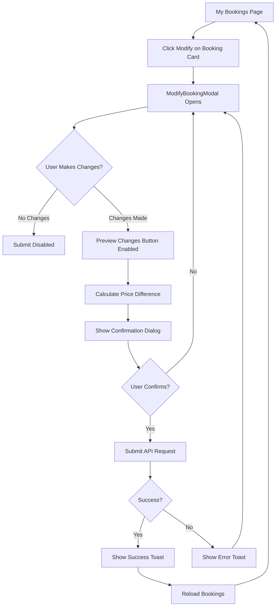

# Frontend Implementation Plan: Modify Booking Feature

## Overview
Create an intuitive UI for users to modify their bookings, including seat class changes and infant status updates. The interface must show price differences, validate changes, and provide clear feedback.

## Architecture Changes

### 1. Type Definitions

#### Update Types
Location: [`booking_system_frontend/src/types/index.ts`](booking_system_frontend/src/types/index.ts:1)

Add new interfaces:

```typescript
export interface ModifyBookingRequest {
  booking_id: number;
  new_seat_class: SeatClass;
  has_infant: boolean;
}

export interface ModifyBookingResponse {
  booking: Booking;
  price_difference: number;  // Positive = charge, Negative = refund
  old_seat_class: SeatClass;
  new_seat_class: SeatClass;
}
```

### 2. API Service

#### New API Function
Location: [`booking_system_frontend/src/services/api.ts`](booking_system_frontend/src/services/api.ts:1)

```typescript
/**
 * Modify an existing booking
 */
export const modifyBooking = async (
  bookingId: number,
  data: Omit<ModifyBookingRequest, 'booking_id'>
): Promise<ModifyBookingResponse | ErrorResponse> => {
  const response = await api.put<ModifyBookingResponse | ErrorResponse>(
    `/modify/${bookingId}`,
    {
      booking_id: bookingId,
      ...data
    }
  );
  return response.data;
};
```

### 3. Component Architecture

#### 3.1 ModifyBookingModal Component
**Location:** `booking_system_frontend/src/components/bookings/ModifyBookingModal.tsx` (NEW FILE)

**Purpose:** Modal dialog for modifying booking details

**Props Interface:**
```typescript
interface ModifyBookingModalProps {
  isOpen: boolean;
  onClose: () => void;
  booking: Booking;
  flight: Flight;
  onModifySuccess: () => void;
}
```

**State Management:**
```typescript
const [selectedClass, setSelectedClass] = useState<SeatClass>(booking.seat_class);
const [hasInfant, setHasInfant] = useState<boolean>(booking.has_infant);
const [isModifying, setIsModifying] = useState(false);
const [priceDifference, setPriceDifference] = useState<number>(0);
const [showConfirmation, setShowConfirmation] = useState(false);
```

**UI Sections:**

1. **Header Section**
   - Title: "Modify Booking"
   - Booking ID display
   - Current flight route

2. **Current Booking Info**
   - Current seat class badge
   - Current infant status
   - Current price

3. **Modification Form**
   - Seat class selector (radio buttons with visual cards)
     - Show available seats for each class
     - Disable classes with 0 seats
     - Highlight current selection
   - Infant toggle switch
     - Label: "Traveling with lap infant (free)"
     - Show baby icon when enabled

4. **Price Comparison Section**
   - Old price display
   - New price display
   - Price difference indicator:
     - Green for refunds (negative)
     - Red for additional charges (positive)
     - Gray for no change

5. **Action Buttons**
   - "Cancel" - Close modal
   - "Preview Changes" - Calculate and show confirmation
   - "Confirm Modification" - Submit changes

**Validation Logic:**
- Disable submit if no changes made
- Check seat availability before allowing selection
- Show warning if downgrading class
- Confirm if removing infant

#### 3.2 Update BookingCard Component
**Location:** [`booking_system_frontend/src/components/bookings/BookingCard.tsx`](booking_system_frontend/src/components/bookings/BookingCard.tsx:1)

**Changes Required:**

Add new prop:
```typescript
interface BookingCardProps {
  booking: Booking;
  flight?: Flight;
  onCancel: (bookingId: number) => void;
  onModify?: (bookingId: number) => void;  // NEW
  isCancelling?: boolean;
}
```

Add "Modify Booking" button:
```typescript
{canModify && (
  <Button
    variant="secondary"
    size="sm"
    onClick={() => onModify?.(booking.booking_id)}
    className="w-full"
  >
    Modify Booking
  </Button>
)}
```

Position: Above the "Cancel Booking" button

**Conditional Display:**
- Only show for bookings with status 'booked'
- Hide if flight is undefined

#### 3.3 Update MyBookings Page
**Location:** [`booking_system_frontend/src/pages/MyBookings.tsx`](booking_system_frontend/src/pages/MyBookings.tsx:1)

**State Additions:**
```typescript
const [showModifyModal, setShowModifyModal] = useState(false);
const [bookingToModify, setBookingToModify] = useState<Booking | null>(null);
const [flightToModify, setFlightToModify] = useState<Flight | null>(null);
```

**Handler Functions:**
```typescript
const handleModifyClick = (bookingId: number) => {
  const booking = bookings.find(b => b.booking_id === bookingId);
  const flight = booking ? getFlightForBooking(booking) : null;
  
  if (booking && flight) {
    setBookingToModify(booking);
    setFlightToModify(flight);
    setShowModifyModal(true);
  } else {
    toast.error('Unable to modify booking - flight information not available');
  }
};

const handleModifySuccess = () => {
  setShowModifyModal(false);
  setBookingToModify(null);
  setFlightToModify(null);
  loadData(); // Reload bookings
};
```

**JSX Updates:**
```typescript
<BookingCard
  key={booking.booking_id}
  booking={booking}
  flight={getFlightForBooking(booking)}
  onCancel={handleCancelClick}
  onModify={handleModifyClick}  // NEW
  isCancelling={cancellingId === booking.booking_id}
/>

{/* Add ModifyBookingModal */}
{showModifyModal && bookingToModify && flightToModify && (
  <ModifyBookingModal
    isOpen={showModifyModal}
    onClose={() => setShowModifyModal(false)}
    booking={bookingToModify}
    flight={flightToModify}
    onModifySuccess={handleModifySuccess}
  />
)}
```

### 4. UI/UX Design Specifications

#### Color Scheme
- **Upgrade (additional cost):** Red/Orange tones
- **Downgrade (refund):** Green tones
- **No change:** Gray/neutral tones
- **Disabled options:** Opacity 50%, cursor not-allowed

#### Seat Class Cards
Reuse existing seat class styling from [`BookingModal.tsx`](booking_system_frontend/src/components/bookings/BookingModal.tsx:1):
- Economy: Blue theme
- Business: Purple theme
- Galaxium: Yellow/Gold theme

#### Animations
Use Framer Motion for:
- Modal entrance/exit
- Price difference reveal
- Success confirmation
- Error shake animation

#### Responsive Design
- Mobile: Stack seat class cards vertically
- Tablet: 2-column grid
- Desktop: 3-column grid

### 5. User Flow



### 6. Error Handling

**Error Scenarios:**
1. **No seats available** - Show inline error, disable class option
2. **Booking already modified** - Show error toast, close modal
3. **Network error** - Show retry option
4. **Validation error** - Show field-specific errors

**Error Display:**
- Use toast notifications for API errors
- Inline validation messages for form errors
- Modal error banner for critical issues

### 7. Accessibility

**Requirements:**
- Keyboard navigation support
- ARIA labels for all interactive elements
- Focus management in modal
- Screen reader announcements for price changes
- Color contrast compliance (WCAG AA)

**Focus Order:**
1. Close button
2. Seat class options
3. Infant toggle
4. Action buttons

### 8. Testing Considerations

**Component Tests:**
- ModifyBookingModal renders correctly
- Price calculation displays accurately
- Form validation works
- API integration functions properly

**User Interaction Tests:**
- Seat class selection updates state
- Infant toggle works
- Submit button enables/disables correctly
- Modal closes on cancel

**Edge Cases:**
- All seats taken in target class
- Booking status changes during modification
- Network timeout during submission
- Concurrent modification attempts

## Implementation Order

1. Update type definitions in [`types/index.ts`](booking_system_frontend/src/types/index.ts:1)
2. Add API function in [`services/api.ts`](booking_system_frontend/src/services/api.ts:1)
3. Create `ModifyBookingModal.tsx` component
4. Update [`BookingCard.tsx`](booking_system_frontend/src/components/bookings/BookingCard.tsx:1) with modify button
5. Update [`MyBookings.tsx`](booking_system_frontend/src/pages/MyBookings.tsx:1) with modal integration
6. Add styling and animations
7. Test all user flows
8. Add accessibility features

## Key Considerations

**Real-time Validation**: Check seat availability before allowing user to proceed with modification.

**Price Transparency**: Always show price difference before final confirmation. Use clear visual indicators.

**Optimistic Updates**: Consider showing immediate UI feedback while API request processes.

**State Synchronization**: Ensure booking list refreshes after successful modification to show updated data.

**Mobile Experience**: Ensure modal is fully functional on mobile devices with appropriate touch targets.