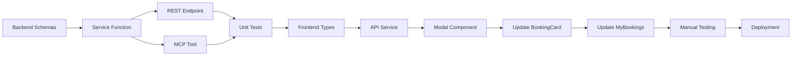

# Modify Booking Feature - Planning Documentation

## Overview
This folder contains comprehensive planning documentation for implementing a booking modification feature in the Galaxium Travels booking system. The feature allows users to change their seat class and infant status for existing bookings.

## Documentation Structure

### 📄 [01-backend-implementation.md](01-backend-implementation.md)
**Backend Architecture & Implementation Plan**

Covers:
- Database schema analysis (no changes required)
- New Pydantic schemas: `ModifyBookingRequest` and `ModifyBookingResponse`
- Service layer implementation: [`modify_booking()`](../../booking_system_backend/services/booking.py:1) function
- REST API endpoint: `PUT /modify/{booking_id}`
- MCP tool integration
- Comprehensive test suite with 9 test cases
- Error handling scenarios
- Seat availability management logic

**Key Technical Details:**
- Atomic seat availability updates (restore old class +1, consume new class -1)
- Price difference calculation for transparency
- Status validation (only 'booked' bookings can be modified)
- Infant status independent of seat class changes

### 📄 [02-frontend-implementation.md](02-frontend-implementation.md)
**Frontend UI/UX & Component Architecture**

Covers:
- TypeScript type definitions
- API service integration
- New component: `ModifyBookingModal.tsx`
- Updates to [`BookingCard.tsx`](../../booking_system_frontend/src/components/bookings/BookingCard.tsx:1)
- Updates to [`MyBookings.tsx`](../../booking_system_frontend/src/pages/MyBookings.tsx:1)
- User flow with Mermaid diagram
- Responsive design specifications
- Accessibility requirements

**Key UI Features:**
- Visual seat class selector with availability indicators
- Real-time price difference calculation
- Confirmation dialog before submission
- Color-coded price changes (green=refund, red=charge)
- Infant toggle independent of seat selection

### 📄 [03-implementation-guide.md](03-implementation-guide.md)
**Step-by-Step Implementation Instructions**

Covers:
- 15 detailed implementation steps across 3 phases
- Phase 1: Backend (Steps 1-5) - 2-3 hours
- Phase 2: Frontend (Steps 6-10) - 3-4 hours
- Phase 3: Testing & Validation (Steps 11-13) - 1-2 hours
- Code snippets for every file change
- Verification commands after each step
- Manual testing checklist
- Troubleshooting guide
- Success criteria

**Total Estimated Time:** 6-9 hours

## Feature Capabilities

### What Users Can Do
✅ Change seat class (Economy ↔ Business ↔ Galaxium)
✅ Add or remove lap infant
✅ View price differences before confirming
✅ See real-time seat availability
✅ Receive clear error messages

### Business Rules
- Only 'booked' status bookings can be modified
- Seat availability validated before modification
- Price differences calculated transparently
- Infants don't consume seats (lap infant)
- Atomic database transactions ensure data integrity

## Technical Architecture

### Backend Stack
- **Framework:** FastAPI + FastMCP
- **Database:** SQLAlchemy ORM with SQLite
- **Service Pattern:** Transport-agnostic business logic
- **Error Handling:** Union types returning `Result | ErrorResponse`

### Frontend Stack
- **Framework:** React + TypeScript
- **UI Library:** Tailwind CSS + Framer Motion
- **State Management:** React hooks
- **API Client:** Axios with interceptors

### API Contract

**Endpoint:** `PUT /modify/{booking_id}`

**Request:**
```json
{
  "booking_id": 1,
  "new_seat_class": "business",
  "has_infant": true
}
```

**Response:**
```json
{
  "booking": {
    "booking_id": 1,
    "user_id": 1,
    "flight_id": 1,
    "seat_class": "business",
    "status": "booked",
    "booking_time": "2026-05-10T09:00:00",
    "has_infant": true
  },
  "price_difference": 500,
  "old_seat_class": "economy",
  "new_seat_class": "business"
}
```

## Implementation Workflow



## Key Design Decisions

### 1. Atomic Seat Management
When changing seat classes, both operations (restore old, consume new) happen in a single transaction. If the new class has no seats, the entire operation fails and no changes are made.

### 2. Price Transparency
The system calculates and displays price differences before final confirmation, allowing users to make informed decisions. Positive values indicate additional charges, negative values indicate refunds.

### 3. Independent Infant Status
Infant status can be toggled independently of seat class changes. This provides flexibility without requiring users to modify their seat class just to add/remove an infant.

### 4. Status-Based Validation
Only bookings with 'booked' status can be modified. This prevents modifications to cancelled or completed bookings, maintaining data integrity.

### 5. Real-time Availability
The UI disables seat class options that have zero availability, preventing users from attempting impossible modifications.

## Testing Strategy

### Backend Tests (7 test cases)
- ✅ Upgrade seat class
- ✅ Downgrade seat class  
- ✅ Add infant without class change
- ✅ Booking not found error
- ✅ Already cancelled error
- ✅ No seats available error
- ✅ Invalid seat class error

### Frontend Tests
- Component rendering
- User interactions
- API integration
- Error handling
- Edge cases

### Manual Testing
- Complete user flows
- Cross-browser compatibility
- Mobile responsiveness
- Accessibility compliance

## Files Modified

### Backend
- [`booking_system_backend/schemas.py`](../../booking_system_backend/schemas.py:1) - Add 2 new schemas
- [`booking_system_backend/services/booking.py`](../../booking_system_backend/services/booking.py:1) - Add `modify_booking()` function
- [`booking_system_backend/server.py`](../../booking_system_backend/server.py:1) - Add REST endpoint and MCP tool
- [`booking_system_backend/tests/test_services.py`](../../booking_system_backend/tests/test_services.py:1) - Add 7 test cases

### Frontend
- [`booking_system_frontend/src/types/index.ts`](../../booking_system_frontend/src/types/index.ts:1) - Add 2 new interfaces
- [`booking_system_frontend/src/services/api.ts`](../../booking_system_frontend/src/services/api.ts:1) - Add `modifyBooking()` function
- `booking_system_frontend/src/components/bookings/ModifyBookingModal.tsx` - **NEW FILE**
- [`booking_system_frontend/src/components/bookings/BookingCard.tsx`](../../booking_system_frontend/src/components/bookings/BookingCard.tsx:1) - Add modify button
- [`booking_system_frontend/src/pages/MyBookings.tsx`](../../booking_system_frontend/src/pages/MyBookings.tsx:1) - Add modal integration

## Next Steps After Implementation

1. **Analytics Integration** - Track modification patterns
2. **Email Notifications** - Notify users of booking changes
3. **Modification History** - Store audit trail of changes
4. **Payment Processing** - Handle price difference transactions
5. **Admin Dashboard** - Monitor and manage modifications

## Getting Started

To implement this feature, follow the documents in order:

1. Read [`01-backend-implementation.md`](01-backend-implementation.md) for architecture understanding
2. Read [`02-frontend-implementation.md`](02-frontend-implementation.md) for UI/UX design
3. Follow [`03-implementation-guide.md`](03-implementation-guide.md) step-by-step

Each document builds upon the previous, providing a complete picture of the feature from planning to deployment.

## Questions or Issues?

Refer to the troubleshooting section in [`03-implementation-guide.md`](03-implementation-guide.md) for common issues and solutions.